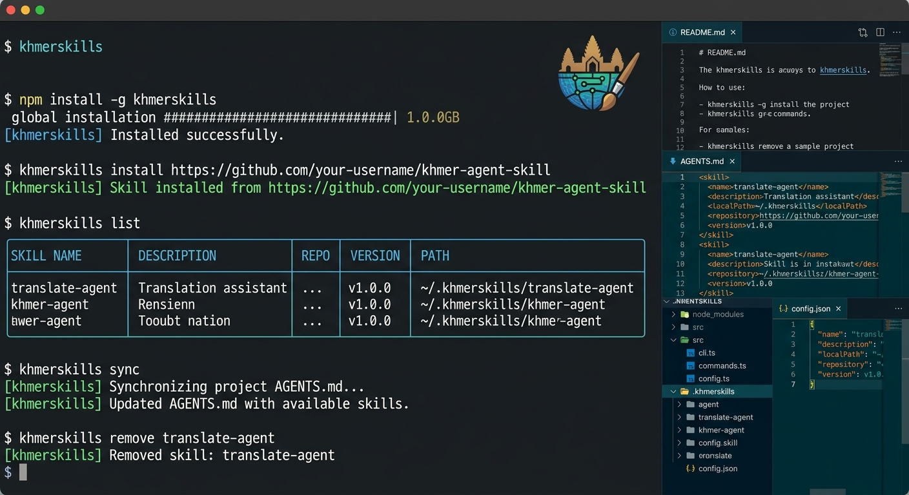

# Khmerskills - Universal AI Agent Skills Loader

A universal skills loader that makes AI agent skills (from Anthropic's Claude) work with any coding agent like GitHub Copilot, Cursor, or any AI that can read files.



## Installation

```bash
npm install -g khmerskills
```

## Commands

### Install Skills
```bash
khmerskills install owner/repository
# or
openskills install numman-ali/openskills
```

### List Installed Skills
```bash
khmerskills list
khmerskills list --verbose  # Show detailed info
```

### Read a Skill
```bash
khmerskills read code-review
```

### Sync Skills with Project
```bash
khmerskills sync
```

### Remove Skills
```bash
khmerskills remove code-review
khmerskills remove --all  # Remove all skills
```

## How It Works

1. Skills are downloaded from GitHub repositories
2. The tool maintains a config file with installed skills
3. Running `sync` updates the project's AGENTS.md with XML-formatted skill listings
4. AI agents read AGENTS.md to discover available skills
5. Agents can use `khmerskills read <skill-name>` to load specific instructions

## AGENTS.md Format

The tool generates/updates an AGENTS.md file with:

```xml
<available_skills>
  <skill>
    <name>code-review</name>
    <description>Code review best practices</description>
    <location>/path/to/skill</location>
    <repository>owner/repo</repository>
    <version>1.0.0</version>
  </skill>
</available_skills>
```

## Skill Repository Format

Each skill repository should contain:
- A main instruction file (SKILL.md, README.md, or INSTRUCTIONS.md)
- Optional `skills.json` with metadata

## Development

```bash
git clone https://github.com/sisovin/khmerskills.git
cd khmerskills
npm install
npm run build
npm link  # For local testing
```

## License

MIT